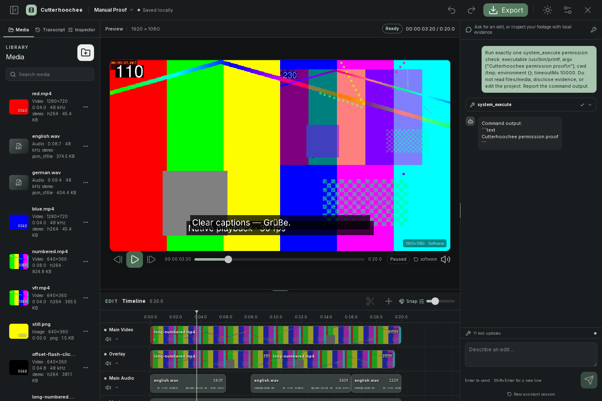
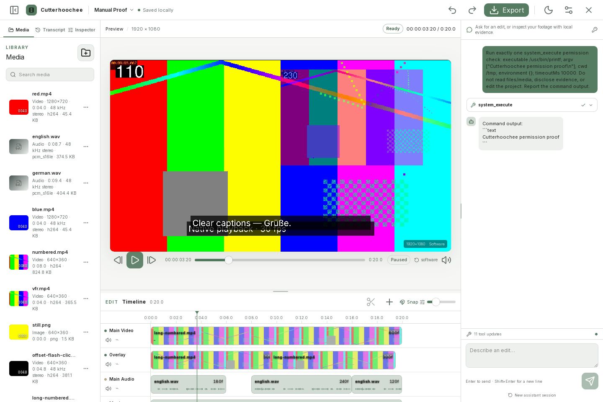
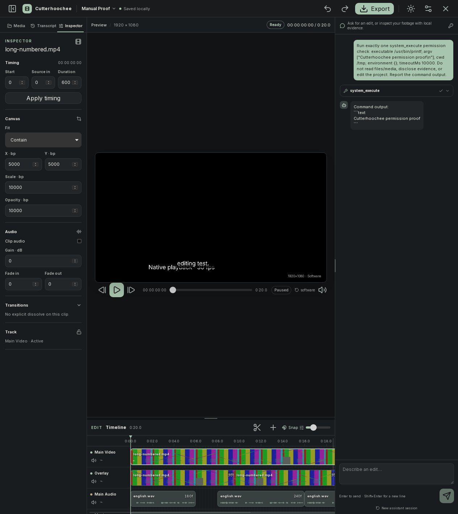
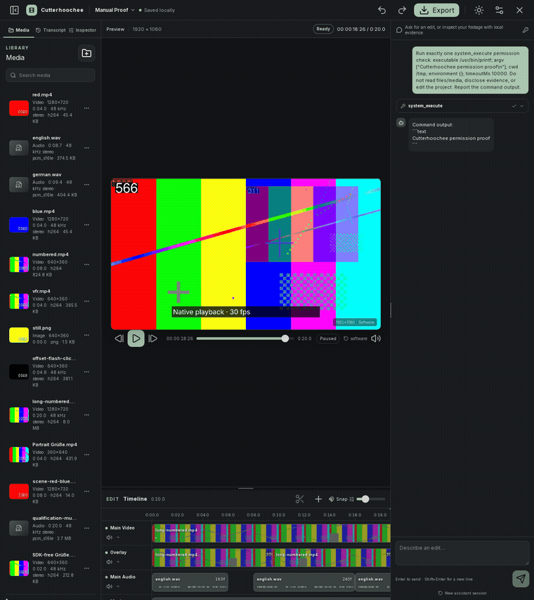
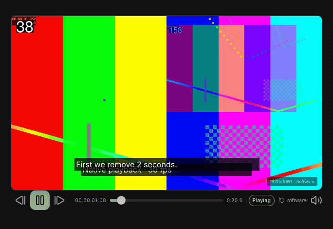
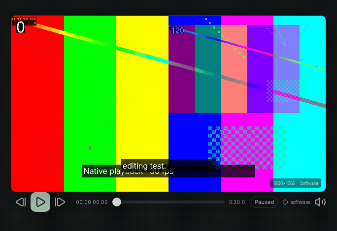
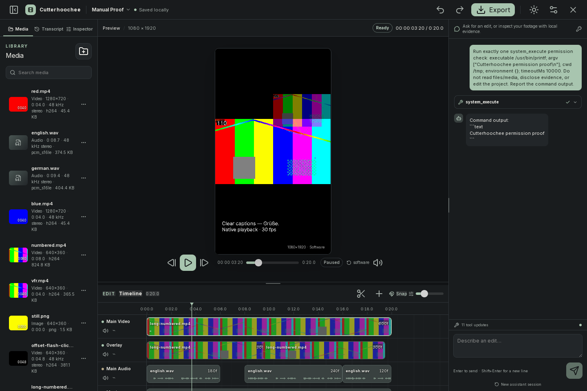
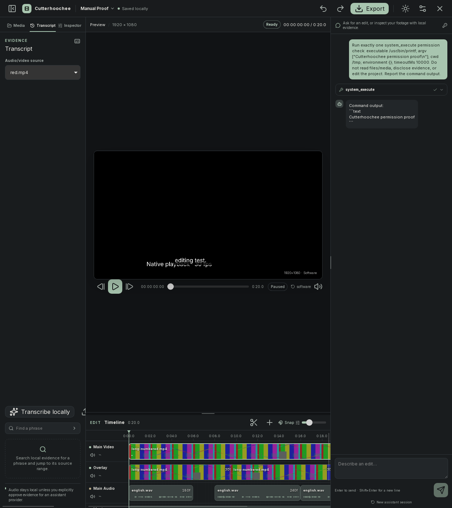
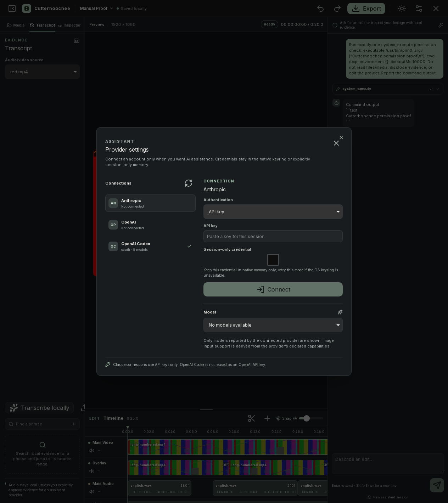
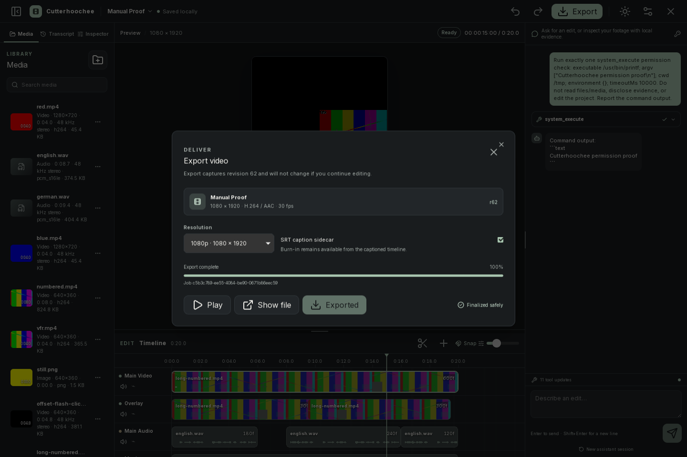

# Cutterhoochee – Benutzerhandbuch (Deutsch)

> **Sprache:** Die Benutzeroberfläche ist derzeit Englisch. Alle Schaltflächen, Menüs und Feldbezeichnungen werden in diesem Handbuch deshalb exakt in ihrer englischen Schreibweise angegeben; die Erläuterungen sind deutsch.

[English user guide](user-guide.en.md)

Cutterhoochee ist ein lokal ausgerichteter Videoeditor für Video, Audio, Bilder, Titel, Untertitel und einen optionalen Pi-Assistenten. Projekte, Medienvorbereitung und lokale Transkription bleiben auf diesem Gerät, sofern Sie nicht ausdrücklich eine externe Freigabe genehmigen. Die Anwendung benötigt eine native Desktop-Anbindung; ein reiner Browser-Vorschaumodus ersetzt diese nicht.

## Inhaltsverzeichnis

1. [Überblick](#1-überblick)
2. [Installation und erster Start](#2-installation-und-erster-start)
3. [Rundgang durch den Arbeitsbereich](#3-rundgang-durch-den-arbeitsbereich)
4. [Projektlebenszyklus](#4-projektlebenszyklus)
5. [Medienimport und Bibliothek](#5-medienimport-und-bibliothek)
6. [Timeline-Bearbeitung](#6-timeline-bearbeitung)
7. [Vorschau und Audio](#7-vorschau-und-audio)
8. [Inspector, Text und Übergänge](#8-inspector-text-und-übergänge)
9. [Transkription und Untertitel](#9-transkription-und-untertitel)
10. [Pi-Assistent, Anbieter und Berechtigungen](#10-pi-assistent-anbieter-und-berechtigungen)
11. [Export](#11-export)
12. [Tastenkürzel](#12-tastenkürzel)
13. [Praktisches End-to-End-Tutorial](#13-praktisches-end-to-end-tutorial)
14. [Fehlerbehebung](#14-fehlerbehebung)
15. [Datenschutz, Speicherung und Portabilität](#15-datenschutz-speicherung-und-portabilität)
16. [Einschränkungen und Glossar](#16-einschränkungen-und-glossar)

---

## 1. Überblick

### Was Cutterhoochee macht

Cutterhoochee verbindet eine klassische, nichtlineare Timeline mit lokal gespeicherten Medienartefakten und einem optionalen Assistenten. Der typische Ablauf ist:

1. Ein Projektformat wählen und ein Projekt anlegen.
2. Video, Audio oder Bilder über einen nativen Dateidialog importieren.
3. Warten, bis die Medienvorbereitung abgeschlossen ist.
4. Assets auf passende Spuren legen, schneiden, verschieben und trimmen.
5. Vorschau, Audiopegel, Titel und Captions prüfen.
6. Optional lokal transkribieren oder eine SRT-Datei importieren.
7. Export starten und die fertige Datei beziehungsweise einen SRT-Sidecar öffnen.

Die Bearbeitung ist auf überprüfbare Projektänderungen ausgelegt: Änderungen werden als nachvollziehbare Transaktionen gespeichert und können über `Undo` und `Redo` zurückgenommen oder wiederhergestellt werden. Externe Dateisystem-, Netzwerk- oder Kommandoaktionen sind davon ausdrücklich ausgenommen.

### Grundbegriffe

- **Projekt:** Ein Verzeichnis mit einer `project.json`-Projektdatei und den von Cutterhoochee verwalteten Medien- und Arbeitsartefakten.
- **Asset:** Ein importiertes Originalmedium mit geprüften Metadaten und vorbereiteten Artefakten.
- **Clip:** Eine Verwendung eines Assets auf einer Timeline-Spur. Mehrere Clips können auf dasselbe Asset verweisen.
- **Spur (Track):** Eine Video-, Audio- oder Textzeile in der Timeline.
- **Playhead:** Die vertikale Abspielposition. Sie wird in Frames gespeichert und zusätzlich als Zeitcode angezeigt.
- **Caption:** Zeitlich verankerte Untertitel. Ein Title ist dagegen ein frei platzierter Titel.
- **Revision:** Die Versionsnummer des Projektstands. Ein Export friert genau die beim Start angegebene Revision ein.
- **Evidence:** Lokal erzeugte, vom Projekt abgeleitete Informationen, zum Beispiel Transkriptspannen, Audiowellenform oder geprüfte Frame-Samples. Evidence wird nicht automatisch an einen Anbieter gesendet.

### Medien und Demonstrationsmaterial in den Handbuchbildern

Die eingebetteten Screenshots und GIFs zeigen absichtlich erzeugtes Testmuster- beziehungsweise Demonstrationsmaterial. Sie sind **keine persönlichen Aufnahmen und keine von Cutterhoochee mitgelieferten Nutzerdateien**. Text wie `Native playback - 30 fps`, Farbbalken oder Zahlen im Bild gehört zum erzeugten Testvideo, nicht zu einem zusätzlichen App-Menü.



*Abbildung 1: Vollständiger Arbeitsbereich im dunklen Theme. Die sichtbaren Clips und Farbmuster stammen aus generiertem Testmaterial.*



*Abbildung 2: Derselbe Arbeitsbereich im hellen Theme. Das Bild dokumentiert den Theme-Zustand, nicht eine deutsche UI-Lokalisierung.*

---

## 2. Installation und erster Start

### Verifizierter Desktop-Weg unter Linux

Verifiziert ist die Ausführung der Linux-x64-AppImage-Version. Bei einer bereitgestellten AppImage-Datei:

1. Speichern Sie die Datei an einem Ort, an dem Sie sie dauerhaft aufbewahren möchten.
2. Gewähren Sie der Datei in den Dateieigenschaften Ausführungsrechte oder machen Sie sie mit dem üblichen Linux-Dateimanager ausführbar.
3. Starten Sie die AppImage-Datei.
4. Warten Sie, bis das Cutterhoochee-Startfenster erscheint.

Das lokal erstellte Linux-x64-Paket dieses Arbeitsstands starten Sie aus dem Projektverzeichnis so:

```bash
chmod +x src-tauri/target/release/bundle/appimage/Cutterhoochee_0.1.0_amd64.AppImage
./src-tauri/target/release/bundle/appimage/Cutterhoochee_0.1.0_amd64.AppImage
```

Dieser Pfad bezeichnet eine lokale Build-Ausgabe, keinen öffentlichen Download. Das Paket enthält die Desktop-Laufzeit und die Medienwerkzeuge; das Sprachmodell wird erst nach Ihrer Zustimmung heruntergeladen. Das Handbuch können Sie unabhängig davon mit `xdg-open docs/index.html` offline lesen.

Bei einer FUSE-/Mount-Fehlermeldung unterstützt dieses Paket auch das vorübergehende Entpacken:

```bash
./src-tauri/target/release/bundle/appimage/Cutterhoochee_0.1.0_amd64.AppImage --appimage-extract-and-run
```

Dies benötigt zusätzlichen temporären Speicherplatz und behebt keine beschädigte Datei oder Grafiktreiberprobleme. Starten Sie den Editor nicht als `root`.

> **Plattformhinweis:** Linux x64 AppImage wurde ausgeführt. Windows und macOS sind in dieser Dokumentation nicht verifiziert; ihre Start- und Paketdetails dürfen nicht aus dem Linux-Ablauf abgeleitet werden.

### Status beim ersten Start

Oben im Startfenster sehen Sie eine Verbindungsanzeige:

- `Desktop ready`: Die native Desktop-Anbindung ist verfügbar.
- `Browser preview · native required`: Die Oberfläche läuft zwar, aber native Aktionen benötigen eine Desktop-Anbindung. Import, Öffnen, Speichern, Medienvorbereitung, lokale Transkription und Export können in diesem Zustand nicht zuverlässig abgeschlossen werden.

Der Startbildschirm enthält außerdem den Hinweis `Offline by default · no telemetry`. Das bedeutet: Es gibt keinen standardmäßigen Telemetrieversand. Eine externe Anbieteranfrage oder ein ausdrücklich genehmigtes Netzwerkwerkzeug ist davon zu unterscheiden.

### Neues Projekt anlegen

1. Öffnen Sie im Startbildschirm den Bereich `New project`.
2. Tragen Sie unter `Project name` einen Namen ein. Wenn das Feld leer bleibt, wird `Untitled project` verwendet.
3. Wählen Sie unter `Aspect` eines der verifizierten Formate:
   - `Landscape · 16:9`
   - `Portrait · 9:16`
   - `Square · 1:1`
4. Wählen Sie unter `Frame rate` zunächst `30 fps`. Über `Advanced format options` werden zusätzlich `24 fps`, `25 fps` und `60 fps` angeboten.
5. Klicken Sie auf `Create project`.

6. Wählen Sie im nativen Dialog den **übergeordneten Ordner**. Darin wird `<Projektname>.cutproj` angelegt. Notieren Sie diesen Pfad für späteres Öffnen und Sichern.

Cutterhoochee erzeugt dabei ein Projektverzeichnis mit der Endung `.cutproj`. Die drei anfänglichen Spuren sind eine Video-, eine Audio- und eine Textspur. Der Name und das Format gehören zur Projektdefinition; wählen Sie sie daher vor dem Aufbau der Timeline bewusst.

### Gespeichertes Projekt öffnen

1. Klicken Sie im Bereich `Continue editing` auf `Open project`.
2. Wählen Sie das gespeicherte `.cutproj`-Verzeichnis im nativen Dialog.
3. Warten Sie, bis Projektstatus, Bibliothek und Timeline geladen sind.

Unter `Recent projects` erscheinen nach Anlegen, Öffnen oder Import zuletzt verwendete **Projektnamen**. Die Liste speichert keine verlässlichen Wiederöffnungspfade: Auch ein Klick auf einen Namen öffnet den allgemeinen Projektauswahldialog. Merken Sie sich den beim Anlegen gewählten Ordner.

Wenn bereits ein Projekt geöffnet ist, weist der Startbildschirm darauf hin, dass Sie zum erneuten Verbinden des Startzustands das Desktop-Fenster aktualisieren sollen. Öffnen Sie nicht gleichzeitig dasselbe Projekt schreibend in mehreren Cutterhoochee-Prozessen.

---

## 3. Rundgang durch den Arbeitsbereich

Nach dem Öffnen eines Projekts ist der Arbeitsbereich in Kopfzeile, linker Werkzeugspalte, zentraler Vorschau mit Timeline und rechter Assistentenspalte gegliedert.

### Kopfzeile

Von links nach rechts finden Sie:

- Cutterhoochee- und Projektnamen sowie den lokalen Speicherstatus, typischerweise `Saved locally`.
- `Undo` und `Redo` für Projekttransaktionen.
- `Export` zum Öffnen des Exportdialogs. Der Tooltip nennt `Export video (Ctrl/Cmd+E)`.
- `Toggle theme` zum Wechsel zwischen dunklem und hellem Theme.
- `Provider settings` zum Konfigurieren optionaler Pi-Anbieter.
- `Close project` schließt das aktuelle Projekt. `Ctrl/Cmd+S` speichert vorher im bereits beim Anlegen gewählten Projektordner; es öffnet keinen „Speichern unter“-Dialog.

`Saved locally` bezieht sich auf den Projektstand auf diesem Gerät. Es bedeutet nicht, dass ein Cloud-Sync stattfindet.

### Linke Werkzeugspalte

Die Werkzeugspalte hat drei Tabs:

- `Media`: Importierte Assets, Suche, Vorschauen und Medienaktionen.
- `Transcript`: Auswahl einer Audio-/Videoquelle, lokale Transkription, SRT-Import, Suche und `Apply captions`.
- `Inspector`: Eigenschaften des ausgewählten Clips oder Textobjekts.



*Abbildung 3: Der Tab `Inspector` für einen ausgewählten Videoclip. Sichtbar sind die Abschnitte `Timing`, `Canvas`, `Audio` und `Transitions`; die Werte müssen als tatsächliche Projektfelder verstanden werden, nicht als simulierte Bildbeschriftungen.*

### Zentrale Vorschau

Die Vorschau zeigt das Bildformat des Projekts und darunter native Transportsteuerungen:

- `Previous frame`
- `Play` beziehungsweise `Pause`
- `Next frame`
- `Preview playhead` als Schieberegler
- aktueller Zeitcode und Gesamtdauer
- Transportstatus wie `paused`, `playing`, `buffering` oder `error`
- Qualitätsumschalter `auto`/`software`
- Audioanzeige, deren Taktung durch die native Uhr erfolgt

Die Vorschau zeigt die gerenderte Projektkomposition, nicht einfach die unveränderte Originaldatei. Bei Fehlern erscheint `Retry preview`.

### Timeline

Unter der Vorschau liegt die Timeline mit:

- `Timeline` und Gesamtdauer,
- Scheren-Schaltfläche `Split selected clip`,
- `Add title`,
- `Snap`,
- `Timeline zoom`,
- Zeitlineal und Playhead,
- Video-, Audio- und Textspuren.

Ein Clip zeigt bei vorbereitetem Videomaterial eine Thumbnail-Leiste und bei Audio eine Wellenform. `native` kennzeichnet eine aus einem verwalteten Artefakt erzeugte Darstellung. Ein fehlendes Vorschaubild bedeutet nicht automatisch, dass das Original gelöscht wurde.

### Rechte Assistentenspalte

Die rechte Spalte ist als `Assistant chat` ausgeführt. Unten steht das Eingabefeld `Describe an edit...`. Der Assistent kann – je nach verbundenem Anbieter, Modell und ausdrücklicher Evidence-Freigabe – Projektstatus lesen, lokale Evidence anfordern und validierte Projektaktionen vorschlagen oder ausführen. Er erhält nicht automatisch die Originaldatei als Videostream.

Die Spaltenbreiten lassen sich über die sichtbaren `Resize timeline`- und `Resize assistant`-Trenner verändern. Eine eingeklappte rechte Spalte kann über `Open assistant` wieder geöffnet werden.

### Theme wechseln

Klicken Sie in der Kopfzeile auf `Toggle theme`. Das Symbol wechselt zwischen Sonne und Mond. Die Einstellung ändert nur die Darstellung des Arbeitsbereichs, nicht Medien, Projektformat oder Exportdaten.



*Abbildung 4: `theme-switch.gif` zeigt den tatsächlichen Arbeitsbereich, der zwischen den Themes wechselt. Das GIF verwendet weiterhin generiertes Demonstrationsmaterial.*

---

## 4. Projektlebenszyklus

### Anlegen, bearbeiten, speichern

Ein neues Projekt beginnt mit einer leeren Timeline und den anfänglichen Spuren. Importierte Assets und alle Clips werden in der Projektdefinition referenziert. Jede akzeptierte Bearbeitung wird als neue Revision gespeichert; der sichtbare Status kehrt danach zu `Saved locally` zurück.

Speichern Sie zusätzlich bewusst mit `Ctrl/Cmd+S`, insbesondere vor größeren Umstrukturierungen, vor dem Beenden und vor einer Sicherung. `Ctrl+S` gilt unter Linux und Windows, `Cmd+S` unter macOS.

### Öffnen und fortsetzen

Zum Fortsetzen:

1. Öffnen Sie das `.cutproj`-Verzeichnis mit `Open project`.
2. Prüfen Sie in `Media`, ob die Assets vorbereitet sind.
3. Klicken Sie die relevanten Clips an und kontrollieren Sie im `Inspector` Quelle, Timing und Audio.
4. Springen Sie in der Timeline an die zuletzt bearbeitete Position.

Die lokale Liste `Recent projects` speichert Namen, nicht den Projektinhalt. Ein vollständiges Projekt enthält verwaltete Medienkopien: Sind diese intakt, bleiben Bearbeitung, Vorschau und Export möglich, auch wenn eine ursprüngliche Quelldatei verschoben wurde. `Relink` wird zur Wiederherstellung fehlender benötigter Medienartefakte benötigt, nicht pauschal nach jedem Umzug.

### Revision und Konflikte

Projektaktionen werden gegen eine erwartete Revision ausgeführt. Wenn ein anderer Prozess oder ein veraltetes Fenster das Projekt verändert hat, zeigt Cutterhoochee den aktuellen Stand an, statt eine fremde Änderung blind zu überschreiben. Bei einer Konfliktmeldung:

1. Lesen Sie die Meldung vollständig.
2. Aktualisieren Sie den Arbeitsbereich.
3. Prüfen Sie, ob Ihre letzte Aktion sichtbar ist.
4. Wiederholen Sie sie erst, wenn die aktuelle Auswahl und Revision stimmen.

### Undo und Redo

`Undo` und `Redo` arbeiten chronologisch auf Projektebene. Sie sind für validierte Timeline-, Clip-, Text- und Transkript-Caption-Änderungen gedacht. Sie machen **keine** externen Wirkungen rückgängig: Ein ausgeführter Systembefehl, eine Netzwerkübertragung, das Überschreiben einer fremden Datei oder ein Export außerhalb der Projektdefinition wird nicht durch Timeline-`Undo` zurückgenommen.

> **Sicherheitsregel:** Prüfen Sie vor jeder destruktiven Aktion Auswahl, Playhead und Zielspur. Verwenden Sie `Undo` als Korrekturhilfe, nicht als Ersatz für eine Sicherung.

### Projektkopie erstellen

Beenden Sie Cutterhoochee oder stellen Sie sicher, dass gerade nicht geschrieben wird, und kopieren Sie das **gesamte** `.cutproj`-Verzeichnis. Kopieren Sie nicht nur `project.json`: Verwaltete Medien, Thumbnails, Wellenformen und Transkripte liegen als getrennte Artefakte im Projektlayout.

---

## 5. Medienimport und Bibliothek

### Unterstützte Importarten

Der Startbildschirm bewirbt `Video, audio, PNG, JPEG, or WebP`. Die native Medienprüfung akzeptiert außerdem eine begrenzte FFmpeg-Demuxer-/Protokollmenge, darunter gängige Container und Audioquellen wie MOV/MP4-verwandte Quellen, Matroska, AVI, MPEG-TS, MPEG, FLV, OGG, MP3, WAV, FLAC und AAC sowie Bildquellen. Ob eine konkrete Datei decodierbar ist, hängt zusätzlich von ihren tatsächlich enthaltenen Streams und dem gebündelten nativen FFmpeg ab.

Bei einer Meldung über ein nicht unterstütztes Medium oder einen nicht erlaubten Demuxer kann die Datei nicht verarbeitet werden. Benennen Sie sie nicht lediglich um; verwenden Sie gegebenenfalls eine kompatible, lokal erzeugte Kopie.

### Import über die Oberfläche

Sie können Medien auf drei Wegen importieren:

1. Klicken Sie auf `Import media` im Startbildschirm oder im Tab `Media`.
2. Drücken Sie `Ctrl/Cmd+I` außerhalb eines Eingabefelds.
3. Ziehen Sie Dateien auf `Drop media to import` im Startbildschirm beziehungsweise in den vorgesehenen Medienbereich.

Der native Dateidialog beziehungsweise die native Dateifreigabe legt fest, welche Dateien Cutterhoochee lesen darf. Ein Import ohne eine gültige Dateifreigabe wird nicht durch einen frei eingegebenen Pfad umgangen.

> **Achtung – Dateizugriff:** Wählen Sie nur die Dateien und Verzeichnisse aus, die Sie wirklich verwenden möchten. Eine Importfreigabe ist keine pauschale Berechtigung für das gesamte Dateisystem.

### Medienvorbereitung abwarten

Nach dem Import erscheint das Asset sofort oder als laufende Vorbereitung in der Bibliothek. Für Video werden unter anderem ein normalisierter Master und eine Proxy-/Vorschauableitung erzeugt; für Audio wird normalisiertes Stereo-PCM mit 48 kHz vorbereitet. Die Oberfläche kann währenddessen `Preparing normalized media…` oder `Media preparation is incomplete.` anzeigen.

Ein Asset ist für die Timeline erst geeignet, wenn seine erforderlichen normalisierten Artefakte vorhanden sind. Die Vorbereitung kann je nach Länge, Auflösung und Audio deutlich länger als der Dialog selbst dauern.

### Bibliothek lesen und durchsuchen

Im Tab `Media`:

- `Search media` filtert nach Dateiname.
- Jeder Eintrag zeigt Typ (`Video`, `Audio` oder `Image`), verfügbare Abmessungen, Dauer, Audioformat, Codec und Dateigröße, soweit vorhanden.
- Klicken Sie einen Eintrag an, um ihn zu markieren und die Aktionen einzublenden.
- `Inspect` stößt eine native Prüfung an und aktualisiert die Ansicht; die aktuelle Oberfläche zeigt keinen gesonderten Bericht zur Originalidentität.
- `Add to timeline` fügt ein vorbereitetes Asset mit der unten beschriebenen Standardplatzierung ein.
- `Relink` wird angeboten, wenn die für das Asset benötigten normalisierten Artefakte nicht bereit sind.
- `Remove` entfernt den Asset-Eintrag nur, wenn keine Clips mehr darauf verweisen.

Cutterhoochee verwaltet Kopien und abgeleitete Artefakte im Projekt. Die Originaldatei außerhalb des Projekts wird durch `Remove` nicht gelöscht. Umgekehrt entfernt das Löschen eines Assets nicht automatisch die zugrunde liegende persönliche Originaldatei.

### Asset in die Timeline bringen

1. Wählen Sie im Tab `Media` ein vorbereitetes Asset.
2. Klicken Sie `Add to timeline` für die Standardplatzierung: Video und Bilder werden an das Ende der ersten Videospur angehängt. Audio beginnt auf der ersten Audiospur bei Frame 0; bei einer vorhandenen Timeline wird die Einfügedauer auf deren Länge begrenzt. Für eine andere Position ziehen Sie das Asset gezielt auf die Timeline oder ändern anschließend `Start` im Inspector.
3. Ziehen Sie den Eintrag auf eine kompatible Spur: Video und Standbilder auf eine Videospur, Audio auf eine Audiospur.
4. Prüfen Sie den neu erzeugten Clip und seine Startposition.

Ein Videoclip ohne Audiostream kann kein Clip-Audio aktivieren. Ein Standbild beginnt immer am Quellenframe null und besitzt kein Clip-Audio. Ein Asset muss vollständig normalisiert sein; unvollständige Medien lassen sich nicht als gültige Clips referenzieren.

### Quelle nicht verfügbar: `Relink`

Eine verschobene Originaldatei allein macht ein vollständig gespeichertes Projekt nicht unbrauchbar. Falls benötigte verwaltete Artefakte fehlen und der Bibliothekseintrag `Relink` anbietet:

1. Markieren Sie das betroffene Asset.
2. Klicken Sie `Relink`.
3. Wählen Sie im nativen Dialog genau die beabsichtigte Ersatzdatei.
4. Warten Sie die erneute Identitätsprüfung und die angebotene Medienvorbereitung ab.
5. Prüfen Sie anschließend Thumbnails, Wellenform, Dauer und Vorschau.

Die Datei muss zur gespeicherten Identität und zum Asset passen. Ein bloß ähnlicher Dateiname genügt nicht; wenn sich der Inhalt geändert hat, behandelt Cutterhoochee das als andere Quelle.

### Medien entfernen

Entfernen Sie zuerst alle Clips, die auf das Asset verweisen. Erst dann wird `Remove` in der Bibliothek erfolgreich sein. Die Reihenfolge schützt davor, dass die Timeline auf ein nicht mehr vorhandenes Asset zeigt.

> **Achtung – destruktiv:** `Remove` entfernt den Asset-Eintrag aus dem Projekt. Sichern Sie das Projekt vorher, wenn Sie nicht sicher sind, ob eine spätere Wiederverwendung davon abhängt. Das Löschen des Projekt-Assets ist nicht dasselbe wie das Löschen der Originaldatei.

---

## 6. Timeline-Bearbeitung

### Spuren, Auswahl und Playhead

Eine neue Projektdefinition enthält die Spuren `Main Video`, `Main Audio` und `Text`. Weitere sichtbare Spurennamen können aus dem jeweiligen Projekt stammen. Jede Spur hat eine eigene Zeile und eigene Schalter:

- `Mute` beziehungsweise `Unmute` schaltet den Audiobeitrag der Spur für Vorschau und Export ein oder aus. Bei einer Videospur bleibt das Bild sichtbar; nur ihr Ton wird stummgeschaltet.
- `Lock` beziehungsweise `Unlock` schützt die Spur vor Bearbeitung.
- Der Status zeigt `Locked`, `Muted` oder `Active`.

Klicken Sie auf einen Clip, um ihn auszuwählen. Mit `Shift` können Sie mehrere Clips ergänzend auswählen. Textobjekte werden separat ausgewählt; eine Textauswahl und eine Clipauswahl werden nicht vermischt.

Klicken Sie in das Zeitlineal, um den Playhead zu setzen. Ziehen Sie im Zeitlineal von einem Start- zu einem Endpunkt, um eine Range zu markieren. Der Range-Zeitbereich wird für die Ripple-Entfernung verwendet.

### Clips einfügen und verschieben

1. Importieren und normalisieren Sie das gewünschte Asset.
2. Ziehen Sie es aus `Media` auf eine passende Spur.
3. Setzen Sie den Playhead an die gewünschte Position oder ziehen Sie den Clip an eine neue Stelle.
4. Lassen Sie den Clip los und warten Sie die bestätigte Transaktion ab.

Ist `Snap` aktiv, rastet die Position in der Nähe von Clipkanten, Playhead und Anfangspunkten ein. Schalten Sie `Snap` aus, wenn Sie bewusst framegenau neben einer Kante platzieren möchten. Ein Clip darf weder seine Quellenlänge überschreiten noch eine unzulässige Überlappung erzeugen.

### Zoomen und Navigieren

Mit `Timeline zoom` vergrößern oder verkleinern Sie die horizontale Darstellung. Beim Zoomen versucht die Oberfläche, die Playhead-Position im sichtbaren Bereich zu halten. Verwenden Sie die horizontalen und vertikalen Scrollbereiche, um lange Projekte und viele Spuren zu navigieren.

### Clip am Playhead teilen

Voraussetzungen: Ein Clip ist ausgewählt und der Playhead liegt **innerhalb** des Clips, nicht auf seiner Außenkante.

1. Wählen Sie den Clip.
2. Platzieren Sie den Playhead an der gewünschten Trennstelle.
3. Klicken Sie `Split selected clip`, wählen Sie im Kontextmenü `Split at playhead` oder drücken Sie `S`.
4. Prüfen Sie, dass die zwei Teilclips ihre erwarteten Source-in- und Timeline-Intervalle haben.

Ein Clip mit einem expliziten `Dissolve` muss vor dem Teilen über `Remove dissolve` bereinigt werden. Das hält den Übergangsgraphen eindeutig. Liegt der Playhead außerhalb des Clips oder ist die Spur gesperrt, wird die Aktion nicht ausgeführt.

### Clip entfernen

1. Wählen Sie einen oder mehrere Clips.
2. Drücken Sie `Delete` oder wählen Sie im Kontextmenü `Remove clip`.
3. Prüfen Sie die entstehende Lücke und verwenden Sie bei Bedarf `Undo`.

Für eine Ripple-Entfernung markieren Sie im Zeitlineal einen gültigen Bereich und drücken `Shift+Delete`. Cutterhoochee entfernt dann den Bereich mit Ripple-Verhalten. **Ohne gültige Range fällt `Shift+Delete` auf das Löschen der ausgewählten Clips zurück; es ist dann kein wirkungsloser Befehl.**

> **Achtung – destruktiv:** `Delete` und besonders `Shift+Delete` ändern die Timeline sofort als Projekttransaktion. Kontrollieren Sie Auswahl, Range und betroffene Spuren. Ohne gültige Range löscht `Shift+Delete` die ausgewählten Clips. Verwenden Sie bei einer unbeabsichtigten Änderung unmittelbar `Undo`.

### Trimmen über den Inspector

Für framegenaues Trimmen ist der Tab `Inspector` zuverlässiger als ein ungenauer Drag:

1. Wählen Sie den Clip.
2. Öffnen Sie `Inspector`.
3. Im Abschnitt `Timing` bearbeiten Sie `Start`, `Source in` und `Duration`.
4. Verwenden Sie für `Start` und `Source in` nichtnegative ganze Frames; `Duration` muss mindestens einen Frame betragen.
5. Klicken Sie `Apply timing`.

`Start` ist die Timeline-Position, `Source in` der Quellenbeginn, `Duration` die Clipdauer. Der Quellenbereich muss innerhalb der normalisierten Asset-Grenzen bleiben. Ein Trim kann einen betroffenen expliziten Dissolve entfernen; prüfen Sie die Transition-Anzeige anschließend.

### Audiospuren und Sperren

`Lock` schützt die Spur vor Bearbeitung. `Mute` schaltet den Audiobeitrag der gesamten Spur in Vorschau und Export stumm; bei einer stummgeschalteten Videospur bleibt das Bild sichtbar. Mit `Clip audio` deaktivieren Sie den Ton des ausgewählten Video- oder Audioclips.

---

## 7. Vorschau und Audio

### Native Vorschau bedienen

Die Vorschau verwendet die aktuelle Projekt-Revision und die native Render-/Transportlogik:

- `Play` startet die Wiedergabe.
- `Pause` hält sie an.
- `Previous frame` und `Next frame` bewegen den Playhead frameweise.
- `Preview playhead` springt zu einem bestimmten Frame.
- Der Zeitcode links zeigt die aktuelle Position, rechts die Gesamtdauer.

Die Vorschau kann `buffering` anzeigen, während das nächste Bild oder Audioartefakt vorbereitet wird. `ended` beendet die Wiedergabe am Ende. Bei `error` verwenden Sie zuerst `Retry preview`; bleibt der Fehler bestehen, wechseln Sie vorübergehend auf `software`.



*Abbildung 5: `playback.gif` zeigt den `Preview`-Transport bei laufendem, generiertem Demonstrationsvideo. Die eingeblendeten Farbbalken, Zahlen und Texte sind Testmaterial und keine Nutzeraufnahme.*

### Auto und Software Preview

Der Qualitätsumschalter zeigt `auto` oder `software`. Klicken Sie auf den Umschalter `Toggle software preview`, wenn die automatische Auswahl auf dem Rechner nicht funktioniert. `software` ist ein Kompatibilitäts-/Fallbackmodus und kann langsamer sein. Er ändert nicht die Projektdateien oder Exportauflösung.

Ein erfolgreich automatisiertes DOM- oder WebView-Ergebnis beweist nicht allein, dass jedes GPU-/Fenster-Backend sichtbar rendert. Bei einer tatsächlich leeren Desktopfläche ist der native Start- und Grafikpfad zu prüfen; verwenden Sie die in [Fehlerbehebung](#14-fehlerbehebung) genannten Schritte.

### Vorschau-Seek ist keine Timeline-Bearbeitung



*Abbildung 6: `timeline-seek.gif` zeigt das Verschieben des Schiebereglers `Preview playhead`. Es zeigt **nicht** das Ziehen, Trimmen oder Verschieben eines Clips in der Timeline.*

Wenn Sie im GIF den Positionsregler bewegen, wird der Playhead gespeichert und die Vorschau springt. Für Timeline-Änderungen müssen Sie die Timeline selbst beziehungsweise den `Inspector` verwenden.

### Audio prüfen

Audio wird beim Import auf eine gemeinsame normalisierte Basis gebracht. Bereitete Audioclips können in der Timeline eine Wellenform anzeigen. Die Vorschau signalisiert mit dem Lautsprechersymbol, dass das Vorschauaudio nach der nativen Uhr geplant wird.

Für einen einzelnen Clip:

1. Wählen Sie den Clip und öffnen Sie `Inspector`.
2. Für den Ton eines Video- oder Audioclips können Sie im Abschnitt `Audio` `Clip audio` aktivieren oder deaktivieren.
3. Ändern Sie `Gain · dB` innerhalb des unterstützten Bereichs `-60` bis `12` dB.
4. Setzen Sie `Fade in` und `Fade out` als Frameanzahl.
5. Spielen Sie den betroffenen Bereich erneut ab.

Der Schalter `Clip audio` gilt für Video- und Audioclips. `Mute` schaltet den Audiobeitrag der gesamten Spur in Vorschau und Export stumm; bei einer stummgeschalteten Videospur bleibt das Bild sichtbar. `Gain · dB` und Fades beeinflussen den Pegel. Prüfen Sie die fertige Ausgabe hörbar.

---

## 8. Inspector, Text und Übergänge

### Clip-Inspector

Wählen Sie einen Videoclip, Audioclip oder Bildclip und öffnen Sie den Tab `Inspector`. Die verfügbaren Gruppen sind:
Die verfügbaren Gruppen hängen vom Spurtyp ab: `Canvas` und `Transitions` gelten für Clips auf Videospuren; `Audio` gilt für Clips auf Video- und Audiospuren.

#### `Timing`

- `Start`: Timeline-Start in Frames.
- `Source in`: Startframe im normalisierten Asset.
- `Duration`: Dauer in Frames.
- `Apply timing`: Werte als eine geprüfte Timing-Änderung anwenden.

`Start` und `Source in` sind nichtnegative ganze Frames; `Duration` muss mindestens einen Frame betragen. Ein Clip darf die vorbereitete Quelle nicht überlaufen.

#### `Canvas`

Bei einem Clip auf einer Videospur bietet der Abschnitt `Canvas`:

- `Fit`: `Contain` bewahrt den gesamten Inhalt innerhalb des Canvas; `Cover` füllt den Canvas und kann Bildbereiche abschneiden.
- `X · bp` und `Y · bp`: Mittelpunktposition in Basispunkten von `0` bis `10000`; `5000` liegt jeweils in der Mitte der Projektfläche.
- `Scale · bp`: Skalierung von `100` bis `40000`; `10000` entspricht 100 %, `5000` entspricht 50 % der eingepassten Größe.
- `Opacity · bp`: Deckkraft von `0` (unsichtbar) bis `10000` (vollständig deckend); `5000` entspricht 50 %.

Bearbeiten Sie Positionen mit Bedacht, besonders bei `Portrait · 9:16`: Eine im Querformat gut sichtbare Position kann im Hochformat außerhalb des sicheren sichtbaren Bereichs liegen.

#### `Audio`

Bei einem Clip auf einer Video- oder Audiospur bietet der Abschnitt `Audio`:

- `Clip audio`: Ton des ausgewählten Video- oder Audioclips an- oder ausschalten.
- `Gain · dB`: Clipverstärkung beziehungsweise -absenkung.
- `Fade in` und `Fade out`: Ein-/Ausblenddauer in Frames.

Standbilder und Videos ohne Audiostream können kein Clip-Audio aktivieren.

#### `Transitions`

Der Abschnitt `Transitions` steht für Clips auf Videospuren zur Verfügung.

Cutterhoochee stellt den verifizierten Übergang `Dissolve` bereit. Er verbindet zwei aufeinanderfolgende Clips einer Videospur. Die Dauer muss mindestens zwei Frames betragen und kürzer als die Dauer beider beteiligten Clips sein.

- Wenn ein Übergang vorhanden ist, erscheint `Dissolve · Nf` und `Remove dissolve`.
- Wenn ein geeigneter nächster Videoclip vorhanden ist, geben Sie unter `Frames` eine Dauer ein und klicken auf `Dissolve next`.
- Vor `Split` muss der Übergang entfernt werden.
- Übergänge auf Audiospuren werden nicht als `Dissolve` unterstützt.

### Titel hinzufügen und bearbeiten

1. Stellen Sie den Playhead auf die gewünschte Titelposition.
2. Klicken Sie in der Timeline auf `Add title`.
3. Cutterhoochee erzeugt auf der Textspur einen Titel mit dem Standardtext `Your title` und einer anfänglichen Dauer von etwa drei Sekunden.
4. Wählen Sie das Textobjekt und öffnen Sie `Inspector`.
5. Bearbeiten Sie `Text`, wählen Sie `Style` (`Clean` oder `Boxed`), ändern Sie Schriftgröße und Position.
6. Klicken Sie außerhalb des Feldes, damit der Wert übernommen wird.

Ist keine Textspur vorhanden, meldet die Oberfläche, dass Sie zuerst eine Textspur hinzufügen müssen. Die aktuelle Standard-Projektdefinition bringt eine Textspur mit.

### Text-Inspector

Bei einem ausgewählten Title oder einer Caption zeigt die Überschrift `Title` beziehungsweise `Caption`. Die sichtbaren Felder sind:

- `Text`: mehrzeiliger Inhalt.
- `Style`: `Clean` oder `Boxed`.
- `Font size` beziehungsweise die entsprechende Größenangabe.
- Positionierungswerte für X und Y.
- `Remove title` beziehungsweise `Remove caption` zum Entfernen des ausgewählten Textobjekts.

Änderungen werden beim Verlassen des Felds als `Update text` gespeichert. Für einen längeren Text verwenden Sie explizite Zeilenumbrüche und prüfen Sie das Ergebnis in der Vorschau.

### Captions und Titel unterscheiden

Ein frei platzierter Title besitzt seine eigene Timeline-Position und Dauer. Eine auf einen Clip angewendete Caption besitzt dagegen eine Quellen-Spanne, die in den Clip projiziert wird. Trimmen oder Verschieben des Clips kann deshalb den sichtbaren Caption-Bereich mitbewegen oder beschneiden. Prüfen Sie nach Clipänderungen alle betroffenen Captions.



*Abbildung 7: Portrait-Vorschau mit der sichtbaren Caption `Clear captions — Grüße.` und dem nativen Wiedergabe-Hinweis im erzeugten Testbild. Das Bild dokumentiert keine deutsche UI-Übersetzung.*

---

## 9. Transkription und Untertitel

### Voraussetzungen für lokale Transkription

Der Tab `Transcript` listet unter `Audio/video source` nur Audio- oder Videoassets mit vorbereitetem, normalisiertem Audio. Ohne ein solches Asset erscheint `No normalized audio source`.



*Abbildung 8: Initialer Zustand des Tabs `Transcript`. `Transcribe locally` und `Import SRT` sind sichtbar, aber es ist noch kein fertiges Transkript dargestellt; die Abbildung darf nicht als abgeschlossene Transkription interpretiert werden.*

### Speech-Modell und Einwilligung

Klicken Sie bei gewählter Audio-/Videoquelle auf `Transcribe locally`. Wenn das native, gepinnte mehrsprachige Sprachmodell noch nicht im App-Speicher liegt, erscheint `Download local speech model?`.

Der Dialog zeigt je nach nativer Modellmeldung:

- `File`
- `Download size`
- `Source`
- optional `Revision`
- optional `SHA-256`
- `Network/use`

`Download and transcribe` lädt das Modell einmalig in den app-eigenen Speicher und verarbeitet die normalisierte Tonspur lokal. Video und Audio werden für diese lokale Transkription nicht hochgeladen. Mit `Not now` lehnen Sie den Download ab; manuelle Bearbeitung und `Import SRT` bleiben verfügbar.

> **Achtung – Einwilligung:** Lesen Sie Quelle, Größe und Prüfsumme, bevor Sie `Download and transcribe` bestätigen. Das Modell ist ein zusätzlicher Netzwerkdownload, auch wenn die anschließende Transkription lokal bleibt.

### Transkript lesen und durchsuchen

Nach erfolgreicher Transkription legt Cutterhoochee lokale Transcript-Evidence mit Quell- und Framekoordinaten ab. Geben Sie im Feld `Find a phrase` eine Wortfolge ein und drücken Sie `Enter` oder die Suchschaltfläche `Search transcript`.

- Treffer zeigen Text und Framebereich.
- Ein Treffer mit `approx.` besitzt angenäherte Zeitgrenzen.
- Klicken Sie einen Treffer an, um zum zugehörigen Quellenbereich zu springen.
- Ein Treffer eines anderen Assets kann erst angesprungen werden, wenn Sie im Feld `Audio/video source` die passende Quelle wählen.

Die Suche arbeitet auf lokal gespeicherten Transcript-Evidence; sie lädt keine Originaldatei zu einem Anbieter.

### Captions anwenden

`Apply captions` wird angezeigt, sobald ein Transcript geladen ist.

1. Wählen Sie im Tab `Transcript` die richtige `Audio/video source`.
2. Wählen Sie in der Timeline den passenden Audio- oder Videoclip dieses Assets.
3. Vergewissern Sie sich, dass die Transcript-ID zur selben Quelle gehört.
4. Klicken Sie `Apply captions`.
5. Prüfen Sie die erzeugten Caption-Objekte in der Textspur und im `Inspector`.

Die Anwendung verweigert eine Quelle, wenn kein passender Clip ausgewählt ist oder das Transcript zu einem anderen Asset gehört. Die erzeugten Captions sind editierbare Projektobjekte; korrigieren Sie Schreibweise, Text, Style und Position anschließend manuell.

> **Achtung – erneutes Anwenden ersetzt Korrekturen:** `Apply captions` baut die clipgebundenen Captions aus dem gespeicherten Transkript neu auf. Erneutes Anwenden entfernt zuvor vorgenommene Text-, Stil- und Positionskorrekturen dieser Captions. Eine Korrektur im Caption-Inspector verändert nicht die ursprüngliche Transkript-Evidence. Wenden Sie Captions zuerst an und korrigieren Sie sie anschließend; verwenden Sie bei einem versehentlichen erneuten Anwenden unmittelbar `Undo`.

### SRT importieren

`Import SRT` öffnet einen nativen Dateidialog. Cutterhoochee erwartet genau eine ausgewählte UTF-8-SRT-Datei. Die Datei muss:

- höchstens 5 MiB groß sein,
- mindestens einen Cue enthalten,
- Zeitstempel im Format `HH:MM:SS,mmm` verwenden,
- streng steigende, nicht überlappende Cue-Intervalle enthalten,
- nichtleeren Cue-Text enthalten.

Die Cues werden relativ zur aktuellen Playhead-Position in einer vorhandenen Textspur als editierbare Captions angelegt. Startzeiten werden auf Projektframes abgerundet, Endzeiten aufgerundet; auch ein sehr kurzer positiver Cue kann dadurch einen Frame belegen. Setzen Sie den Playhead vor dem Import bewusst an die gewünschte Stelle.

> **Achtung – SRT-Position:** Der Import ersetzt nicht automatisch die gesamte Timeline. Er fügt Caption-Objekte relativ zur aktuellen Playhead-Position ein. Prüfen Sie nach dem Import Position und Überschneidungen. Einen falschen Import-Offset korrigieren Sie mit `Undo` und erneutem Import am richtigen Playhead.

Eine minimale UTF-8-SRT-Datei zum Ausprobieren:

```srt
1
00:00:00,000 --> 00:00:02,000
Willkommen bei Cutterhoochee.

2
00:00:02,000 --> 00:00:04,000
Los geht es.
```

Soll die erste Caption am Timeline-Anfang erscheinen, setzen Sie `Preview playhead` vor dem Import auf Frame 0.

### SRT im Export mitspeichern

Im Exportdialog aktivieren Sie `SRT caption sidecar`, wenn zusätzlich zum Video eine SRT-Begleitdatei erzeugt werden soll. Die eingeblendeten Captions bleiben dabei in der Timeline vorhanden; der Sidecar ist eine zusätzliche Ausgabedatei.

---

## 10. Pi-Assistent, Anbieter und Berechtigungen

### Was Pi im Arbeitsbereich tun kann

Der rechte Bereich verwendet Pi als Assistenten-Harness. Formulieren Sie eine Bitte im Feld `Describe an edit...`, zum Beispiel:

- `Untersuche den aktuellen Projektstatus und nenne mir die Länge jeder Videospur. Ändere noch nichts.`
- `Wähle den Videoclip am Playhead aus und teile ihn am Playhead. Frage vorher nach, falls ein Dissolve entfernt werden müsste.`
- `Suche im lokalen Transkript nach „Begrüßung“ und springe zum ersten Treffer.`
- `Füge auf der Textspur am aktuellen Playhead einen kurzen Titel „Sommer 2026“ hinzu. Verwende den Style Boxed.`
- `Bereite einen Export der aktuellen Revision in 720p mit SRT-Sidecar vor, aber starte ihn erst nach meiner Bestätigung.`

Der Assistent soll seine Aktionen auf validierte Projektoperationen abbilden. Bei unklarer Auswahl, einer veralteten Revision oder einer fehlenden Quelle kann die native Schicht die Aktion ablehnen. Prüfen Sie die Timeline danach trotzdem selbst.

### Evidence und direkte Videodaten

Ein Sprachmodell erhält nicht automatisch das native Videomedium. Pi kann lokale, vom Projekt erzeugte Evidence anfordern, beispielsweise:

- Projekt- und Timeline-Snapshots,
- Transcript-Spannen,
- geprüfte Frame-Samples,
- lokale Audio-/Szenen-/Stilleanalyse,
- Vorschauinformationen.

Jeder Assistenten-Prompt benötigt vor der Ausführung eine zusätzliche Evidencefreigabe. Diese gilt für den Projekt-/Workspace-/Anbieter-/Kontokontext und **nicht nur für ein einzelnes Asset oder einen Zeitbereich**. Nach gültiger Freigabe werden auch selbst eingegebene Chatnachrichten an den verbundenen Anbieter gesendet. Die Anwendung behauptet nicht, dass jedes Modell native Videodaten als Eingabe unterstützt.

### Provider settings öffnen

Öffnen Sie `Provider settings` über das Einstellungs-Symbol in der Kopfzeile. Der Dialog hat einen Bereich `Connections` und einen Verbindungsbereich für den ausgewählten Anbieter.



*Abbildung 9: `Provider settings` mit dem Anthropic-API-Key-Formular. Das Feld ist leer; die Abbildung enthält keine Zugangsdaten oder persönlichen Kontodaten. In der Verbindungsliste ist eine OpenAI-Codex-Verbindung als vorhanden dargestellt.*

### Unterstützte Anbieter und Anmeldung

Die native Provider-Matrix ist absichtlich eng begrenzt:

- `Anthropic`: API-Key-Authentifizierung.
- `OpenAI`: API-Key-Authentifizierung.
- `OpenAI Codex`: OAuth-/Subscription-Authentifizierung des SDK.

Weitere Provider oder alternative Authentifizierungswege dürfen nicht aus der zugrunde liegenden Pi-Bibliothek abgeleitet werden. `OpenAI Codex` wird nicht als OpenAI-API-Key wiederverwendet.

Für Anthropic oder OpenAI:

1. Wählen Sie den Anbieter.
2. Lassen Sie `Authentication` auf `API key`.
3. Tragen Sie den Schlüssel nur in das vorgesehene geheime Feld ein.
4. Aktivieren Sie optional `Session-only credential`, wenn der Schlüssel nicht im nativen Schlüsselbund gespeichert werden soll.
5. Klicken Sie `Connect`.

Für `OpenAI Codex` wählen Sie die angebotene OAuth-Anmeldung und folgen Sie den nativen Authentifizierungsanweisungen. Authentifizierungsereignisse können eine URL, einen Gerätecode oder eine weitere Eingabe verlangen. Folgen Sie nur den im Dialog angezeigten, erlaubten Zielen.

### Credential-Speicherung

Dauerhafte Anmeldedaten werden, sofern verfügbar, im nativen Credential Store beziehungsweise OS-Keyring verwaltet. Mit `Session-only credential` bleibt ein eingegebener Schlüssel nur im ausdrücklich vorgesehenen Sitzungsbereich. Wenn der Schlüsselbund nicht verfügbar ist, wählen Sie diese Option erneut; Cutterhoochee speichert in diesem Fehlerfall keinen Klartextschlüssel in der Projektdatei.

- `Refresh providers` aktualisiert Anbieter- und Modellstatus.
- Das Modellmenü wird dynamisch aus dem aktuell gewählten Anbieter geladen.
- Wählen Sie unter `Model` ein tatsächlich gemeldetes Modell; vor der Auswahl kann `Choose a model` angezeigt werden.
- `Disconnect` trennt den ausgewählten Anbieter. Für eine erneute Anmeldung verwenden Sie `Connect` beziehungsweise `Refresh connection`, nicht lediglich `Refresh providers`.

Die angezeigte Modellanzahl und Modellliste sind dynamisch. Eine hier nicht sichtbare Modell-ID ist nicht automatisch verfügbar; dokumentieren Sie keine festen Modelle, die Ihr Anbieter- oder SDK-Katalog nicht meldet.

### Externe Berechtigungsdialoge

Bei einer genehmigungspflichtigen Datei-, System-, HTTP-, Upload- oder Überschreibaktion zeigt Cutterhoochee `Permission required`. Lesen Sie vor `Allow once` mindestens:

- `Operation`,
- Zielpfad beziehungsweise Zielpfade,
- `Executable` und `Arguments`,
- `Working directory`,
- URL und Methode, sofern vorhanden,
- Datenumfang beziehungsweise Body-Prüfsumme,
- Zielidentität und `overwrite`-Status.

Berechtigungsanfragen laufen nach kurzer Zeit ab (native Standardgültigkeit: 120 Sekunden). Bei `Deny` oder abgelaufener Anfrage wiederholt der Assistent die Aktion nicht stillschweigend.

> **Achtung – kein Sandbox-Versprechen:** Ein `system_execute`-Vorgang läuft mit Ihrem Benutzerkonto und dessen Datei- und Netzwerkrechten. Das `Working directory` ist **keine Sandbox**. Abgeschlossene Wirkungen werden nicht durch `Undo` in Cutterhoochee rückgängig gemacht. Genehmigen Sie nur exakt erwartete Programme, Argumente und Ziele.

Ein harmloses, in der Proof-Aufnahme sichtbares Beispiel ist `/usr/bin/printf` mit einer festen Textausgabe. Das Beispiel ist Demonstrationsmaterial; ersetzen Sie es nicht unkritisch durch Shells, Paketmanager, Löschbefehle oder unbekannte Skripte.

### Evidence an externe Anbieter freigeben

Eine Provider-Verbindung allein reicht nicht aus. **Jeder Assistenten-Prompt**, auch eine reine Statusabfrage oder Schnittanweisung, benötigt vor der Ausführung die Evidencefreigabe. Der Dialog `Share project evidence?` betrifft den gesamten angezeigten Kontext:

1. Prüfen Sie den angezeigten Anbieter, das Konto und den Projektkontext.
2. Entscheiden Sie, ob verwaltete Frames, Thumbnails und Transkriptspannen aus diesem Projekt an dieses Konto gesendet werden dürfen.
3. Bestätigen Sie `Allow evidence` nur, wenn Sie diese **weiter gefasste Projektfreigabe** beabsichtigen.
4. Lehnen Sie ab, wenn das Projekt Inhalte enthält, die der Anbieter nicht erhalten soll.

Der Dialog zeigt **keine vollständige Einzelprüfung eines konkreten Assets oder Zeitbereichs**. Die Freigabe wird im app-eigenen Berechtigungsspeicher für den Workspace-/Projekt-/Anbieter-/Kontokontext hinterlegt; spätere Evidence-Anfragen im gültigen Kontext können ohne erneuten Dialog bedient werden. Sie ist dennoch keine allgemeine Dateisystem- oder Systembefehl-Freigabe. Lokale Transkription selbst lädt die Audiodatei nicht hoch; für andere externe Aktionen gelten deren eigene Berechtigungen.

Es gibt derzeit keinen eigenen Schalter zum Widerrufen einer Evidencefreigabe. Verwenden Sie im noch laufenden Editor `Close project`, um den aktiven Projektkontext und seine Freigaben zu beenden; nach erneutem Öffnen ist eine neue Freigabe erforderlich. Ein bloßer Neustart der Anwendung ist **kein verlässlicher Widerruf**, weil die app-eigene Berechtigungsdatei erneut geladen wird. `Stop` beendet einen Lauf, widerruft aber nicht automatisch die Evidencefreigabe.

---

## 11. Export

### Exportdialog öffnen

Klicken Sie in der Kopfzeile auf `Export` oder drücken Sie `Ctrl/Cmd+E`. Der Dialog `Export video` zeigt:

- den Projektnamen,
- die aktuell eingefrorene Revision, zum Beispiel `r12`,
- Zielformat und Framerate,
- `Resolution`,
- `SRT caption sidecar`,
- Fortschritt und Exportstatus.

Der Dialog zeigt H.264/AAC und die Framerate des Projektprofils. Die verfügbaren Ausgabegrößen sind:

- `1080p` mit der zum Aspect passenden Abmessung,
- `720p` mit der zum Aspect passenden Abmessung.

Für `Portrait · 9:16` führt `1080p` beispielsweise zu `1080 × 1920`; für `Landscape · 16:9` zu einer entsprechenden Querformatgröße.

### Export starten

1. Prüfen Sie die angezeigte Revision und die Zielabmessungen.
2. Wählen Sie `1080p` oder `720p` unter `Resolution`.
3. Aktivieren Sie optional `SRT caption sidecar`.
4. Klicken Sie `Export`.
5. Wählen Sie das MP4-Ziel im nativen Dialog. Danach erscheint **bei jedem Export** `Permission required`: Prüfen Sie das Ziel und bestätigen Sie mit `Allow once`, wenn der Schreibvorgang beabsichtigt ist. Ein vorhandenes Ziel benötigt eine Überschreibfreigabe. Bei aktiviertem SRT-Sidecar folgt eine **zweite, eigene Freigabe** für die SRT-Datei, gegebenenfalls ebenfalls zum Überschreiben.
6. Warten Sie auf `Export complete`.

Der Export ist unveränderlich: Er rendert exakt die beim Start angegebene Revision. Wenn Sie während des Renderns weiterarbeiten, ändern diese neuen Timeline-Änderungen den laufenden Export nicht.

### Fortschritt, Abbruch und Ergebnis

Während des Vorgangs erscheinen unter anderem:

- `Choosing destination…`
- `Waiting for export worker…`
- `Rendering immutable revision…`
- `Export complete`
- `Export cancelled`
- `Export failed`

Mit `Cancel` können Sie einen laufenden Auftrag abbrechen. Nach erfolgreichem Abschluss stehen `Play` und `Show file` zur Verfügung. `Finalized safely` bestätigt, dass der Exportauftrag vollständig abgeschlossen wurde.



*Abbildung 10: Abgeschlossener `Export video`-Dialog mit `1080p · 1080 × 1920`, aktiviertem `SRT caption sidecar`, 100 %, `Play`, `Show file` und `Finalized safely`. Das angezeigte Projekt und die Export-Job-ID stammen aus einer generierten Proof-Aufnahme.*

### Sidecar und eingebrannte Captions

`SRT caption sidecar` erzeugt neben der gewählten MP4-Datei eine Datei mit demselben Basisnamen und der Endung `.srt`; es gibt dafür keinen zweiten Dateiauswahldialog. Die SRT-Datei benötigt jedoch eine eigene Schreib- beziehungsweise Überschreibfreigabe. Sie enthält Timeline-Captions, keine frei platzierten Titel. Sichtbare Caption-/Textobjekte werden weiterhin in das Video gerendert; der Sidecar ist eine zusätzliche Ausgabe.

> **Achtung – Zielpfad:** Ein Exportziel außerhalb des Projekts ist eine eigene Dateioperation. Prüfen Sie Pfad und Überschreibziel im nativen Dialog. `Undo` in der Timeline löscht oder restauriert eine bereits geschriebene Ausgabedatei nicht.

---

## 12. Tastenkürzel

Die folgenden globalen Tastenkürzel sind in der Oberfläche implementiert. Sie gelten nur, wenn kein `input`, `textarea`, `select` oder editierbares Content-Element fokussiert ist. In Eingabefeldern bleiben normale Textbearbeitungsbefehle unberührt. Die dokumentierte Desktop-Qualifikation gilt für Linux; `Cmd` beschreibt die entsprechende implementierte macOS-Tastenbehandlung, keinen verifizierten macOS-Build.

| Tastenkürzel | Wirkung | Voraussetzung / Hinweis |
|---|---|---|
| `Space` | Wiedergabe umschalten (`Play`/`Pause`) | Gilt außerhalb von Eingabefeldern. |
| `ArrowLeft` | Einen Frame zurück | Playhead wird nicht negativ. |
| `ArrowRight` | Einen Frame vor | Der native Bereich begrenzt die Position. |
| `S` | Ausgewählten Clip am Playhead teilen | Playhead muss innerhalb des Clips liegen; ein `Dissolve` muss zuerst entfernt werden. |
| `Delete` | Ausgewählte Clips entfernen | Textauswahl allein wird damit nicht als Clip entfernt. |
| `Shift+Delete` | Markierte Range mit Ripple entfernen | Ohne gültige Range werden stattdessen die ausgewählten Clips gelöscht. |
| `Ctrl/Cmd+Z` | `Undo` | Projekttransaktion rückgängig machen. |
| `Ctrl/Cmd+Shift+Z` | `Redo` | Zuvor rückgängig gemachte Projekttransaktion wiederholen. |
| `Ctrl/Cmd+I` | `Import media` öffnen | Native Dateifreigabe erforderlich. |
| `Ctrl/Cmd+S` | Projekt speichern | Speichert lokal; kein Cloud-Sync. |
| `Ctrl/Cmd+E` | `Export video` öffnen | Startet den Export erst nach Auswahl im Dialog. |

`Cmd` ist die macOS-Bezeichnung; unter Linux verwenden Sie `Ctrl`. `Backspace` ist kein Timeline-Löschkürzel. Für Timeline-Zoom, `Snap`, Track-Mute/Lock, Inspector-Aktionen und Vorschauqualität verwenden Sie die sichtbaren Bedienelemente.

Bei gezielt fokussierten Bedienelementen gelten außerdem:

| Fokus | Tastenkürzel | Wirkung |
|---|---|---|
| Assistenten-Eingabe | `Enter` / `Shift+Enter` | Nachricht senden / Zeilenumbruch |
| Transkript-Suche | `Enter` | Suche auslösen |
| Medienbibliothek-Eintrag | `Enter` / `Space` | Asset-Aktionen anzeigen |
| Trenner `Resize timeline` | `ArrowUp` / `ArrowDown` | Höhe der Timeline verändern |
| Trenner `Resize assistant` | `ArrowLeft` / `ArrowRight` | Breite der Assistentenspalte verändern |

---

## 13. Praktisches End-to-End-Tutorial

Dieses Tutorial verwendet absichtlich erzeugtes Testmaterial. Sie können Ihre eigenen Dateien einsetzen, sollten aber bei externen Aufnahmen Einwilligungen und Berechtigungen der abgebildeten oder hörbaren Personen beachten.

### 13.1 Projekt anlegen

1. Starten Sie Cutterhoochee und prüfen Sie `Desktop ready`.
2. Geben Sie unter `Project name` `Sommergruß` ein.
3. Wählen Sie `Portrait · 9:16`.
4. Lassen Sie `30 fps` eingestellt.
5. Klicken Sie `Create project`.
6. Prüfen Sie, dass `Main Video`, `Main Audio` und `Text` in der Timeline erscheinen.

### 13.2 Video und Ton importieren

1. Drücken Sie `Ctrl/Cmd+I`.
2. Wählen Sie ein Testvideo und eine passende Audiodatei.
3. Bestätigen Sie die native Dateifreigabe.
4. Warten Sie in `Media`, bis die Hinweise `Preparing normalized media…` verschwunden sind.
5. Wählen Sie den Videoclip und klicken Sie `Add to timeline`.
6. Fügen Sie das Audioasset auf `Main Audio` ein.
7. Spielen Sie einen kurzen Bereich ab und kontrollieren Sie in `Inspector`, ob `Clip audio` beim Videoclip wie gewünscht aktiv ist.

Wenn Ihr Video bereits passenden Ton enthält, vermeiden Sie eine doppelte Tonspur: Deaktivieren Sie `Clip audio` am Videoclip, wenn die separate Audiospur verwendet werden soll. `Mute` schaltet den Audiobeitrag einer Spur in Vorschau und Export stumm; bei einer stummgeschalteten Videospur bleibt das Bild sichtbar. `Clip audio` funktioniert ebenso für den Ton eines reinen Audioclips.

### 13.3 Schnitt und Gestaltung

1. Setzen Sie den Playhead in die Mitte des Videoclips.
2. Drücken Sie `S` und kontrollieren Sie beide Teilclips.
3. Wählen Sie den unerwünschten Teil und drücken Sie `Delete`.
4. Falls keine Lücke bleiben soll, markieren Sie die zu entfernende Range und drücken Sie `Shift+Delete`.
5. Ziehen Sie einen zweiten Videoclip auf `Main Video` und aktivieren Sie `Snap`, um ihn sauber an den ersten Clip anzulegen.
6. Wählen Sie den ersten Clip, öffnen Sie `Inspector` und setzen Sie im Abschnitt `Canvas` `Fit` auf `Contain` oder `Cover`.
7. Passen Sie im Abschnitt `Audio` `Gain · dB` und gegebenenfalls `Fade in`/`Fade out` an.
8. Stellen Sie den Playhead an den Beginn des gewünschten Titels und klicken Sie `Add title`.
9. Wählen Sie das erzeugte Textobjekt, ändern Sie `Text` in `Sommergruß`, wählen Sie `Boxed` und platzieren Sie den Text mit X/Y im sicheren Bereich.

Speichern Sie mit `Ctrl/Cmd+S` und spielen Sie den Übergang zwischen den Clips ab. Wenn Sie einen `Dissolve` benötigen, wählen Sie den linken Clip, tragen Sie im Abschnitt `Transitions` unter `Frames` eine zulässige Dauer ein und klicken Sie `Dissolve next`. Teilen Sie diesen Bereich später nur, nachdem Sie `Remove dissolve` verwendet haben.

### 13.4 Untertitel erzeugen oder importieren

**Variante A – lokal transkribieren:**

1. Öffnen Sie den Tab `Transcript`.
2. Wählen Sie die Audio-/Videoquelle unter `Audio/video source`.
3. Klicken Sie `Transcribe locally`.
4. Lesen Sie den Dialog `Download local speech model?`.
5. Bestätigen Sie nur nach Prüfung der Modellangaben mit `Download and transcribe`; andernfalls klicken Sie `Not now`.
6. Warten Sie, bis das lokale Transkript bereit ist.
7. Suchen Sie unter `Find a phrase` nach einem markanten Wort.
8. Klicken Sie den Treffer an und kontrollieren Sie den Quellenbereich.
9. Wählen Sie den passenden Clip in der Timeline und klicken Sie `Apply captions`.
10. Öffnen Sie jedes erzeugte `Caption`-Objekt im `Inspector`, korrigieren Sie Text und Style und prüfen Sie die Portrait-Vorschau.

**Variante B – vorhandene SRT-Datei:**

1. Setzen Sie den Playhead an den gewünschten Caption-Start.
2. Öffnen Sie `Transcript` und klicken Sie `Import SRT`.
3. Wählen Sie genau eine UTF-8-SRT-Datei.
4. Prüfen Sie die Caption-Zeiten. Falls der Import am falschen Playhead-Offset liegt, machen Sie ihn mit `Undo` rückgängig, setzen den Playhead korrekt und importieren erneut. Der Text-Inspector bietet derzeit keine manuellen Start-/Dauerfelder; die Textobjekte lassen sich nicht wie Videoclips zeitlich ziehen.

### 13.5 Vorschau und optionaler Assistent

1. Drücken Sie `Space` oder klicken Sie `Play`.
2. Verwenden Sie `Previous frame`, `Next frame` und `Preview playhead`, um Caption-Synchronität zu prüfen.
3. Wenn die GPU-Vorschau fehlerhaft ist, schalten Sie den Qualitätsumschalter auf `software` und wiederholen Sie die Wiedergabe.
4. Geben Sie Pi eine reine Prüfbitte, zum Beispiel:

   > `Prüfe den Projektstatus und nenne mir die Clips, deren Audio stummgeschaltet ist. Ändere nichts.`

5. Vor der ersten Assistenten-Ausführung im Kontext – auch einer Statusabfrage – prüfen Sie `Share project evidence?`. `Allow evidence` erlaubt verwaltete Frames, Thumbnails und Transkriptspannen im Projekt-/Workspace-/Anbieter-/Kontokontext, nicht nur das im Prompt erwähnte Asset.
6. Wenn Pi eine Systemaktion anbietet, lesen Sie `Executable`, `Arguments`, `Working directory` und die übrigen Details. Genehmigen Sie nur eine exakt erwartete, harmlose Aktion oder wählen Sie `Deny`.

Vergeben Sie keine Provider- oder Systemberechtigung nur deshalb, weil Pi eine Aktion vorschlägt. Lokale Bearbeitungen und externe Wirkungen sind unterschiedliche Vertrauensgrenzen.

### 13.6 Export mit Sidecar

1. Speichern Sie mit `Ctrl/Cmd+S`.
2. Öffnen Sie `Export`.
3. Prüfen Sie Projektname, Revision, Format und Framerate.
4. Wählen Sie `1080p` für die finale Ausgabe oder `720p` für eine kleinere Vorschau.
5. Aktivieren Sie `SRT caption sidecar`.
6. Klicken Sie `Export` und wählen Sie das Ziel.
7. Bestätigen Sie die MP4- und die separate SRT-Schreibfreigabe jeweils mit `Allow once`, sofern die angezeigten Ziele stimmen; prüfen Sie vorhandene Dateien vor jeder Überschreibfreigabe. Warten Sie anschließend auf `Export complete` und 100 %.
8. Klicken Sie `Play`, um die Ausgabe zu prüfen, oder `Show file`, um ihren Speicherort anzuzeigen.
9. Sichern Sie anschließend das gesamte `.cutproj`-Verzeichnis und die fertige Ausgabedatei getrennt.

---

## 14. Fehlerbehebung

### Startbildschirm zeigt `Browser preview · native required`

Die Weboberfläche ist geladen, aber die native Bridge ist nicht verfügbar. Starten Sie die verifizierte Linux-x64-AppImage-Datei als Desktop-Anwendung erneut. Verwenden Sie keine Browser-URL als Ersatz für die nativen Projekt-, Datei- und Exportaktionen.

### AppImage startet, aber das Desktopfenster bleibt leer

Das ist von einem funktionierenden automatisierten WebView zu unterscheiden. Prüfen Sie:

1. dass Sie tatsächlich die AppImage-Datei und nicht nur eine Browser-Vorschau gestartet haben,
2. dass das Fenster auf dem erwarteten X11-/Wayland-Display sichtbar ist,
3. ob der Linux-Grafikstack WebKitGTK/GPU-Fehler meldet,
4. ob der native Software-Preview-Umschalter das Problem nur in der Vorschau behebt.

Die Linux-Qualifikation wurde auf NVIDIA-Hardware durchgeführt; ein systemweiter Grafiktreiber- oder Compositor-Fehler ist nicht automatisch ein Cutterhoochee-Projektfehler. Windows- und macOS-Startpfade sind nicht verifiziert.

### `Media import was cancelled`

Der native Dialog wurde geschlossen oder es wurde keine Datei ausgewählt. Starten Sie `Import media` erneut und bestätigen Sie eine Datei. Bei einem manuellen Drag-and-drop müssen die Pfade vom Desktop an die native Bridge übergeben werden können.

### Ein Medium wird als nicht unterstützt abgelehnt

Prüfen Sie:

- Dateityp und tatsächlich enthaltene Audio-/Videostreams,
- ob der Container innerhalb der FFmpeg-Allowlist liegt,
- ob die Datei vollständig und lesbar ist,
- ob das Medium nicht nur eine URL, Playlist oder ein nicht erlaubtes Spezialformat ist.

Eine reine Umbenennung der Dateiendung behebt keinen inkompatiblen Container.

### Asset bleibt bei `Preparing normalized media…`

Warten Sie zunächst auf die native Hintergrundaufgabe. Bleibt `Media preparation is incomplete.` bestehen:

1. Prüfen Sie Hinweise am Bibliothekseintrag und etwaige Fehlermeldungen. `Inspect` aktualisiert die Ansicht, zeigt aber keinen separaten Detailbericht.
2. Prüfen Sie, ob das benötigte Original noch verfügbar und unverändert ist.
3. Wird `Relink` angeboten, wählen Sie die exakt passende Quelle erneut.
4. Warten Sie die angebotene Vorbereitung ab und prüfen Sie danach Thumbnail, Dauer und Audioformat. Intakte verwaltete Medien bleiben auch ohne Originalzugriff verwendbar.

### `Remove` wird abgelehnt

Mindestens ein Clip referenziert das Asset. Entfernen Sie zuerst diese Clips aus der Timeline und wiederholen Sie `Remove`. Das Original außerhalb des Projekts wird durch diese Aktion nicht gelöscht.

### Clip lässt sich nicht einfügen oder verschieben

Prüfen Sie, ob:

- die Zielspur zum Assettyp passt,
- die Zielspur `Locked` ist,
- der Quellenbereich innerhalb der normalisierten Assetlänge liegt,
- die gewünschte Position keine verbotene Videoüberlappung erzeugt,
- das Asset vollständig vorbereitet ist.

Schalten Sie `Snap` testweise aus, wenn nur die Position überraschend einrastet.

### `Split` tut nichts

Der Playhead muss innerhalb des ausgewählten Clips liegen. Bei einem vorhandenen `Dissolve` entfernen Sie zuerst `Remove dissolve`. Prüfen Sie außerdem, ob Sie wirklich einen Clip und nicht nur ein Textobjekt ausgewählt haben.

### Falsche Audioausgabe oder kein Ton

Prüfen Sie in dieser Reihenfolge:

1. Prüfen Sie, ob die betreffende Spur stummgeschaltet ist. `Mute` schaltet ihren Audiobeitrag in Vorschau und Export stumm; bei einer Videospur bleibt das Bild sichtbar.
2. Ist `Clip audio` beim Video- oder Audioclip eingeschaltet, falls dessen Ton gewünscht ist?
3. Liegt `Gain · dB` nicht auf einer ungewollten Absenkung?
4. Sind `Fade in`/`Fade out` länger als der hörbare Teil?
5. Ist im Projekt ein Audioasset mit normalisiertem Audio vorhanden?
6. Läuft die Vorschau tatsächlich oder steht sie auf `buffering`/`error`?

### Vorschau ist leer, hängt oder zeigt `Preview unavailable`

Klicken Sie `Retry preview`. Wenn der Fehler wiederkehrt, wechseln Sie auf `software`. Prüfen Sie anschließend, ob das Asset vorbereitet und die Timeline-Revision gültig ist. Ein Fehler in der Browser- oder GPU-Darstellung ist nicht zwingend ein beschädigtes Projekt.

### `No normalized audio source` im Transcript-Tab

Importieren Sie ein Video oder Audio mit einem decodierbaren Audiostream und warten Sie die Normalisierung ab. Ein reines Standbild oder ein Video ohne Ton kann nicht lokal transkribiert werden.

### Modell-Dialog erscheint erneut oder Transkription startet nicht

Lesen Sie `Download local speech model?` und bestätigen Sie `Download and transcribe` erst nach Prüfung des Downloads. Prüfen Sie für den einmaligen Download Netzwerkzugriff, freien App-Speicher sowie die native Modellquelle. Ohne Modell können Sie SRT importieren und die daraus entstandenen Captions bearbeiten oder manuell Titel anlegen.

### Transkript-Treffer gehören zur falschen Quelle

Wählen Sie die Quelle im Feld `Audio/video source` erneut. Ein Treffer darf nur auf seine eigene Assetquelle angewendet werden. Wählen Sie anschließend den passenden Audio-/Videoclip, bevor Sie `Apply captions` verwenden.

### SRT-Import wird abgelehnt

Prüfen Sie Dateigröße, UTF-8-Kodierung, nichtleeren Cue-Text und das Zeitformat `HH:MM:SS,mmm`. Die Cues müssen aufsteigend und ohne Überlappung sortiert sein; ihre positiven Zeitintervalle werden nach außen auf Projektframes gerundet. Importieren Sie genau eine SRT-Datei und setzen Sie den Playhead vor dem Import richtig.

### Pi meldet fehlenden Anbieter oder fehlendes Modell

Öffnen Sie `Provider settings`, klicken Sie `Refresh providers` und laden Sie die Modellliste des ausgewählten Anbieters. Modellverfügbarkeit ist dynamisch. Prüfen Sie außerdem, dass die Verbindung zum richtigen Provider besteht: `OpenAI Codex` ist eine OAuth-/Subscription-Verbindung und kein OpenAI-API-Key.

### API-Key kann nicht gespeichert werden

Wenn eine Meldung auf `keyring`, `secret service` oder `credential store` verweist, aktivieren Sie `Session-only credential` und versuchen Sie die Verbindung erneut. Geben Sie den Schlüssel nur im Dialog ein und speichern Sie ihn niemals in `project.json`, Chatnachrichten oder Screenshots.

### Authentifizierungsdialog wartet

Ein OAuth-, Gerätecode- oder Geheimnis-Prompt wartet auf eine Eingabe. Lesen Sie Provider und Ziel, geben Sie nur die erwartete Information ein und brechen Sie eine unbekannte URL oder unerwartete Aufforderung ab. `Refresh providers` aktualisiert den Status; eine abgelaufene Anmeldung starten Sie über die angebotene Anmeldeaktion erneut.

### Permission-Dialog abgelaufen oder abgelehnt

Native Berechtigungsanfragen laufen nach etwa 120 Sekunden ab. Wiederholen Sie nur die konkrete Aktion, nachdem Sie Pfad, Programm, Argumente und Ziel erneut geprüft haben. `Deny` sollte nicht durch wahllose Wiederholung umgangen werden.

### Export schlägt fehl oder wird abgebrochen

Prüfen Sie:

- die im Dialog angezeigte Projekt-Revision,
- freien Speicherplatz am Ziel,
- Schreibrechte und absoluten Zielpfad,
- ob benötigte Assets vorbereitet und verfügbar sind,
- ob eine Überschreibbestätigung erforderlich ist.

Bei `Export cancelled` wurde kein vollständiger finaler Export bestätigt. Bei `Export failed` lesen Sie die native Fehlermeldung, korrigieren Sie die Ursache und starten Sie einen neuen Export. Neue Timeline-Änderungen nach dem Start ändern den alten Export nicht; starten Sie für den aktuellen Stand eine neue Revision.

---

## 15. Datenschutz, Speicherung und Portabilität

### Was lokal bleibt

Cutterhoochee ist standardmäßig lokal ausgerichtet:

- Projektzustand und Revisionen werden im `.cutproj`-Verzeichnis gespeichert.
- Importierte Originale werden nicht gelöscht.
- Normalisierte Video-, Audio- und Bildartefakte werden projektbezogen verwaltet.
- Thumbnails und Wellenformen werden aus diesen verwalteten Artefakten erzeugt.
- Transkripte werden lokal unter dem Projekt-/App-Speicher verwaltet.
- Die lokale Transkription verarbeitet normalisiertes Audio auf dem Gerät.
- Es gibt standardmäßig keine Telemetrie.

### Was nicht automatisch lokal bleibt

Die lokale Standardeinstellung schließt ausdrücklich genehmigte externe Vorgänge aus:

- Anbieteranfragen an Anthropic, OpenAI oder OpenAI Codex,
- vom Assistenten angeforderte und freigegebene Text- oder Bild-Evidence,
- genehmigte HTTP-Aktionen,
- genehmigte Uploads,
- genehmigte Systembefehle.

Prüfen Sie bei der Evidencefreigabe insbesondere Anbieter, Konto und den weiter gefassten Projektkontext. Der Dialog zeigt keine vollständige Einzelauflistung aller künftig übertragenen Assets und Zeitbereiche. Ein API-Key ist ein Geheimnis und gehört weder in eine Caption noch in eine Chatnachricht.

### Projektverzeichnis und app-eigener Speicher

Ein `.cutproj`-Verzeichnis enthält mindestens `project.json` sowie je nach Projekt verwaltete Artefaktbereiche für Mastervideo, Proxy, PCM-Audio, Bilder, Thumbnails, Wellenformen, Frames und Transkripte. Zusätzlich können interne Sperr-, Workspace- und Bindungsdateien existieren. Ändern oder löschen Sie diese Dateien nicht manuell, während das Projekt geöffnet ist.

Das Speech-Modell liegt im app-eigenen Speicher und ist kein Teil jeder Projektkopie. Beim Kopieren eines Projekts kann daher ein erneuter Modell-Download erforderlich sein.

### Berechtigungen und Kopien

Datei-, Evidence- und Systemberechtigungen gehören zur laufenden App-/Workspace-Identität und werden nicht als portable Projektfreigabe behandelt. Eine Kopie erbt keine frühere Autorisierung für externe Zugriffe. Vorhandene verwaltete Medienkopien können trotzdem für Bearbeitung, Vorschau und Export genutzt werden. Neue externe Zugriffe und eine nötige Quellenwiederherstellung erfordern passende Freigaben.

Auch Anbieter-Credentials sind nicht Bestandteil des `.cutproj`-Archivs. Sie liegen im nativen Schlüsselbund oder – bei `Session-only credential` – nur im Sitzungsbereich. Sichern Sie keine Schlüsselbunddateien zusammen mit dem Projekt.

### Sicherung und Umzug

Für eine belastbare Sicherung:

1. Speichern Sie mit `Ctrl/Cmd+S`.
2. Warten Sie, bis Medien- und Exportaufgaben beendet sind.
3. Beenden Sie Cutterhoochee.
4. Kopieren Sie das gesamte `.cutproj`-Verzeichnis.
5. Sichern Sie finale Exporte und SRT-Sidecars separat.
6. Bewahren Sie Zugangsdaten nicht in derselben Sicherung auf.

Für einen Umzug:

1. Kopieren Sie das vollständige Projektverzeichnis auf das Zielgerät.
2. Öffnen Sie die Kopie mit `Open project`.
3. Prüfen Sie, ob die verwalteten Medien vollständig mitkopiert wurden. Intakte Master- und Audiodateien benötigen keinen erneuten Originalzugriff.
4. Nur wenn benötigte Artefakte fehlen und `Relink` angeboten wird, wählen Sie die passende Quelle erneut und warten die Vorbereitung ab.
5. Prüfen Sie Vorschau, Captions und Export vor der produktiven Verwendung.

Portabilität bedeutet nicht, dass absolute Originalpfade, Berechtigungen oder app-eigene Modelle automatisch mitwandern.

### Datenschutz bei Aufnahmen und Sprache

Bevor Sie fremde Video-/Audioinhalte importieren, transkribieren, als Frame-Evidence anzeigen oder an einen Anbieter freigeben, klären Sie die erforderlichen Einwilligungen. Ein lokaler Verarbeitungspfad reduziert Netzwerkübertragung, ersetzt aber nicht die rechtliche Verantwortung für Aufnahme, Speicherung und Weitergabe.

---

## 16. Einschränkungen und Glossar

### Bekannte Einschränkungen

- **Plattform:** Linux x64 AppImage ist ausgeführt und verifiziert. Windows und macOS sind unbestätigt.
- **UI-Sprache:** Die UI ist Englisch. Eine deutsche Lokalisierung der Controls wird nicht behauptet.
- **Native Bridge:** Für Projekt-, Datei-, Medien-, Transkriptions- und Exportaktionen ist die native Desktop-Anbindung erforderlich.
- **Medienformate:** Der native Import ist auf eine Allowlist von Demuxern/Protokollen und die tatsächlich vorhandenen decodierbaren Streams begrenzt.
- **Projektprofile:** Die Startoberfläche bietet 16:9, 9:16 und 1:1 sowie 24, 25, 30 und 60 fps (die zusätzlichen Frameraten erscheinen unter `Advanced format options`).
- **Audio:** Normalisiertes Audio ist für die lokale Transkription erforderlich; Standbilder besitzen kein Clip-Audio.
- **Stummschaltung:** Track-`Mute` schaltet den Audiobeitrag dieser Spur in Vorschau und Export stumm; bei einer Videospur bleibt das Bild sichtbar. `Clip audio` deaktiviert den Ton sowohl von Video- als auch von Audioclips.
- **Übergänge:** Der verifizierte Übergang ist `Dissolve` auf Videospuren mit zwei passenden Clips. Vor dem Split muss er entfernt werden.
- **Untertitel:** Transcript-Captions und SRT-Import sind verfügbar; SRT muss UTF-8, <= 5 MiB und strikt nicht überlappend sein.
- **Sprachmodell:** Lokale automatische Transkription benötigt einen einwilligungsgebundenen Download des mehrsprachigen Modells. Ohne diesen Download bleiben SRT-Import, Bearbeitung importierter Captions und manuelle Titel verfügbar.
- **Anbieter:** Nur `Anthropic` und `OpenAI` über API-Key sowie `OpenAI Codex` über OAuth-/Subscription sind in der nativen Matrix vorgesehen. Modelle werden dynamisch aufgelistet.
- **LLM-Eingabe:** Ein Modell bekommt nicht automatisch natives Video. Es erhält nur die vom Assistenten angeforderten und freigegebenen Evidence-Daten.
- **Externe Wirkungen:** Systembefehle, Netzwerkzugriffe, Uploads und Überschreibungen sind nicht Teil der Timeline-History und werden nicht durch `Undo` rückgängig gemacht.
- **Demonstrationsassets:** Die Handbuchbilder und GIFs zeigen generiertes Testmaterial und sind keine Aussage über die privaten Dateien eines Anwenders.

### Glossar

- **AppImage:** Selbstenthaltendes Linux-Paketformat, das Cutterhoochee hier für Linux x64 verwendet.
- **Asset:** Importierte Quelle samt geprüfter Identität, Metadaten und verwalteten Normalisierungsartefakten.
- **Caption:** Zeitlich synchronisierte Textzeile, typischerweise aus einem Transcript oder einer SRT-Datei.
- **Clip:** Timeline-Instanz eines Assets mit Start, Source-in, Dauer und Darstellungseigenschaften.
- **Contain:** Canvas-Anpassung, bei der der vollständige Medieninhalt sichtbar bleibt.
- **Cover:** Canvas-Anpassung, bei der der Canvas gefüllt wird und Ränder des Mediums abgeschnitten werden können.
- **Dissolve:** Weicher Übergang zwischen zwei aufeinanderfolgenden Videoclips.
- **Evidence:** Geprüfte, projektbezogene Information wie Transcript-Spanne, Frame-Sample oder Analyseergebnis.
- **Frame:** Einzelbild der Projekt-Timeline. Timing-Felder und Tastenschritte verwenden Frames, Zeitcodes zeigen zusätzlich Sekunden.
- **Generation:** Laufende native Projekt-/Workspace-Identität, die veraltete Antworten und Berechtigungen abgrenzt.
- **Master:** Normalisierte, projektbezogene Videoableitung für authoritative Vorschau und Exportplanung.
- **Native bridge:** Tauri-/Desktop-Verbindung zwischen UI und lokalen Projekt-, Medien- und Systemdiensten.
- **Playhead:** Aktuelle Abspiel- und Auswahlposition.
- **Proxy:** Kleinere bzw. schnellere, aus dem verwalteten Master erzeugte Vorschauableitung.
- **Revision:** Monotoner Projektstand, gegen den Bearbeitungen und unveränderliche Exporte ausgeführt werden.
- **Ripple:** Entfernen eines Zeitbereichs mit Nachrücken späterer Timeline-Inhalte.
- **SRT:** SubRip-Textdatei mit nummerierten, zeitlich geordneten Untertitel-Cues.
- **Sidecar:** Separate Begleitdatei, hier eine SRT-Datei zusätzlich zum exportierten Video.
- **Snap:** Einrastfunktion für Clipkanten, Playhead und andere zeitliche Bezugspunkte.
- **Source in:** Quellenframe, an dem ein Clip im importierten Asset beginnt.
- **Spur / Track:** Video-, Audio- oder Textzeile in der Timeline.
- **Textspur:** Spur für `Title`- und `Caption`-Objekte.
- **Transkript:** Lokal gespeicherte Sprachsegmente mit Text und Quellkoordinaten.
- **Workspace:** App-/Projektkontext, an den lokale Autorisierungen und laufende Sitzungen gebunden sind.

Wenn eine sichtbare Funktion von dieser Beschreibung abweicht, vertrauen Sie der tatsächlichen englischen Beschriftung und der nativen Fehlermeldung. Dokumentieren Sie keine vermeintliche deutsche UI-Übersetzung oder eine Provider-/Modellverfügbarkeit, die Ihr laufender Katalog nicht anzeigt.
